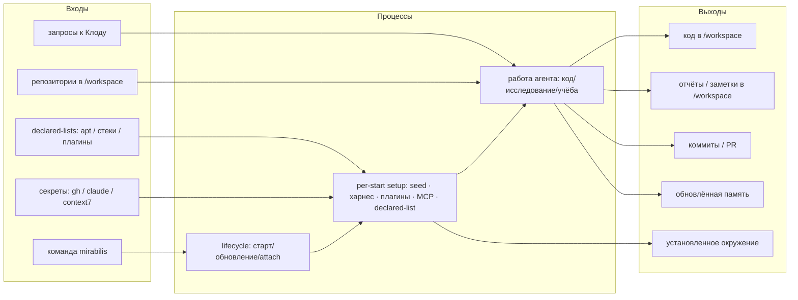
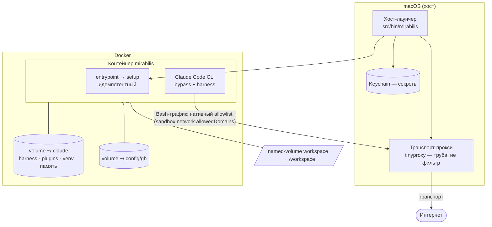

# mirabilis — Архитектура

> Индекс и легенда [ВЛАДЕЛЕЦ]/[ИИ]: [README.md](README.md). Контракт: [INVARIANTS.md](INVARIANTS.md).
> `[текущее]` — как в коде сейчас; `[цель]` — целевое. Провенанс смешанный, помечен по разделам.

## 1. Вход / выход / процессы

> Сами входы/выходы — **[ВЛАДЕЛЕЦ]** (из твоих слов). Группировка в схему — **[ИИ]**.



- **Входы [ВЛАДЕЛЕЦ]:** одна команда; секреты (запрашиваются при отсутствии); репозитории (клонируются в
  `/workspace`); запросы к агенту; декларативные списки окружения.
- **Процессы [ИИ]:** lifecycle, идемпотентный per-start setup, работа агента.
- **Выходы [ВЛАДЕЛЕЦ]:** код, отчёты/заметки, коммиты/PR, обновлённая память, установленное окружение.
- **Уведомления [ИИ] (F3):** односторонний «зуммер» в Telegram на событиях `Stop`/`Notification`
  (хук + `sendMessage`); см. [INVARIANTS.md](INVARIANTS.md) I-Telegram. Отвечает владелец в терминале.

## 2. Компоненты [ИИ]

> ⚠️ Обновлено D39: host-proxy `tinyproxy` и внутренняя Claude-песочница сняты — egress открыт,
> граница = контейнер. Узел `PRX` и упоминания proxy/allowlist на схемах ниже описывают прежнее состояние.

> Декомпозиция предложена ассистентом из существующего кода + целей; не диктовалась дословно.

> [ИИ]-переход (PR «coherent box»): интерактивный UI вынесен в Go-бинарь (Bubble Tea + Bubbles
> `list` + Lip Gloss + Huh), `gum` убран; Bash остаётся оркестратором (docker/proxy/Keychain/preflight) и
> считает статус, Go только рендерит и печатает выбор. Пункты меню пишут декларативное состояние,
> применение — при старте (I9). Egress-allowlist расширен (`api.telegram.org`, arXiv/HF/PyTorch
> для MCP).



## 3. Жизненный цикл и оркестрация

- **Реализовано (PR «coherent box», закрывает H2):** единый идемпотентный **entrypoint контейнера**
  (`.devcontainer/entrypoint.sh` → `refresh.sh`) прогоняет per-start setup, поэтому любой старт —
  `mirabilis`, `docker compose up`, авто-рестарт Docker — поднимает контейнер уже настроенным.
  `postStartCommand` убран (единственный источник setup). Жёсткий STOP при сломанном крит-пути делает
  хостовый preflight (I7), entrypoint не падает в crash-loop под `restart: unless-stopped`.
- **Персистентность процесса [ВЛАДЕЛЕЦ]:** контейнер остаётся запущенным в фоне (Docker управляет
  ресурсами), останавливается только при обновлении; `restart: unless-stopped` сохраняется.
- **Обновление — деструктивно (правило в I4):** см. [INVARIANTS.md](INVARIANTS.md) I4 — здесь не дублируется.

## 4. Файловые зоны [ВЛАДЕЛЕЦ]

```mermaid
flowchart LR
  subgraph CT["Контейнер — всё пишемо (I2)"]
    WS[/workspace/\nработа · репозитории · отчёты · заметки\n(named-volume, песочница владеет)]
    TMP[/tmp/\nэфемерный скретч]
    REST["остальное:\nсистемные файлы · плагин/харнес · /home · /var ...\n(пишемо; рестарт пересоберёт)"]
  end
```

Внутри контейнера **всё пишемо** — root, любые файлы, sudo (I2). mirabilis **не защищает файлы
внутри**: граница безопасности — **сам контейнер** + host-изоляция (I5). Сломал своё окружение —
рестарт пересоберёт его (I4); это своя песочница агента.

- **`/workspace`** — рабочая зона. Вся работа, `git clone` всех репозиториев, файлы, отчёты, заметки.
  Физически — **named-volume, которым владеет песочница** (`workspace`); на хост папкой не торчит,
  открывается из редактора через VSCode (Dev Containers attach / Clone in Container Volume);
  переживает пересоздание.
- **`/tmp`** — эфемерный скретч (исчезает с контейнером).
- **Всё прочее** (system/харнес/`/home`/`/var` …) — тоже пишемо, но эфемерно: не переживает
  пересоздание, кроме того, что лежит в volume’ах (см. §5). Никакого противопоставления «gated» нет.

Поведенческие лимиты (не ломать **чужое**: push/force в `main`, эксфильтрация кредов наружу) — дело
**харнеса** [neuro-matrix](https://github.com/AlexShchuka/neuro-matrix), а не песочницы mirabilis.

## 5. Окружение и персистентность

> Решения [ВЛАДЕЛЕЦ] (что должно жить/обновляться); конкретные механизмы [ИИ].

Два **разных** механизма персистентности — не путать (уточнение F4):

| Что | Механизм [ИИ] | Переживает пересоздание? |
|---|---|---|
| neuro-matrix, плагины | volume `~/.claude` + обновление при старте | да (volume) |
| правила памяти `~/.claude/rules/*.md` (path-scoped по типу файла) | volume `~/.claude` + seed no-clobber при старте | да (volume) |
| python — **интерпретатор** | declared apt-list, переустановка при старте | да (переустановка) |
| python — **venv / пакеты проектов** | volume / `/workspace` | да |
| прочие системные пакеты (`apt`) | declared apt-list, применяется при старте | да (переустановка) |
| ad-hoc установки | разово | нет (если не в списке) |

**Python — оба уровня [ВЛАДЕЛЕЦ] (решение F1):** системный интерпретатор в apt-list, виртуальные окружения
и зависимости проектов — в volume / `/workspace`.

База — **минимум + по требованию [ВЛАДЕЛЕЦ]**. Стек проекта — **глобальный список + ad-hoc «прошу Клода» [ВЛАДЕЛЕЦ]**.

## 6. Сеть

> ⚠️ Обновлено D39: внутренняя Claude-песочница и host-proxy `tinyproxy` сняты — egress
> открыт, единственная граница = контейнер (I5/I6/I8). Ниже описано прежнее состояние.

- **Чтение / research [ВЛАДЕЛЕЦ]:** `WebFetch` Клода достаточно (идёт по Anthropic API). [ИИ]: `WebSearch`
  — туда же, как дополнение (владельцем не оговаривался).
- **Установка пакетов [ВЛАДЕЛЕЦ]:** реестры (pypi/nuget/debian/MS/go) в allowlist + ad-hoc (добавлением домена в allowlist); `WebFetch`
  пакетным менеджерам **не помогает** (см. T4 в [DECISIONS.md](DECISIONS.md)).
- **Где живёт фильтр egress [ИИ] (сверено с [SECURITY.md](../SECURITY.md)):** собственно ограничение egress — это
  **нативный allowlist Claude Code** (`sandbox.network.allowedDomains`, через bubblewrap+socat внутри контейнера),
  он применяется к Bash-трафику агента. Хостовый `tinyproxy` — **транспортная труба** (`HTTP(S)_PROXY` контейнера),
  а не доменный фильтр; одного слоя фильтрации, а не двух.
- **Изоляция (I5) [ВЛАДЕЛЕЦ]:** контейнер не влияет на Mac. [ИИ]-замечание: сетевой трафик идёт через
  хост-прокси-трубу, поэтому полностью «нулевым» для хоста его называть нельзя (прокся живёт на хосте);
  файловой системы Mac контейнер не касается.

## 7. Память и структура работы

- **Память — глобальная [ВЛАДЕЛЕЦ]:** глобальные факты про владельца (`~/.claude`) + нативный
  per-project контекст Claude. Пер-папочной изоляции памяти **нет**.
- **Раскладка `/workspace` — свободная форма [ВЛАДЕЛЕЦ]:** конвенция папок **снята**, фиксированной
  структуры не навязывается; раскладывай как удобно.
