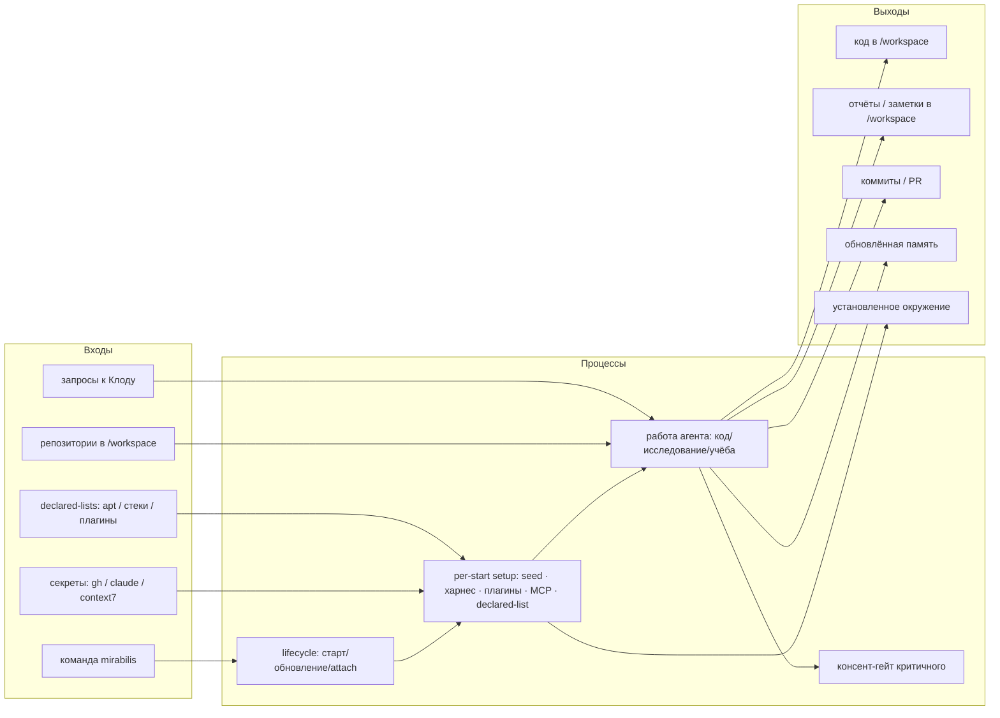

# mirabilis — Архитектура

> Индекс и легенда [И]/[ИИ]: [README.md](README.md). Контракт: [INVARIANTS.md](INVARIANTS.md).
> `[текущее]` — как в коде сейчас; `[цель]` — целевое. Провенанс смешанный, помечен по разделам.

## 1. Вход / выход / процессы

> Сами входы/выходы — **[И]** (из твоих слов). Группировка в схему — **[ИИ]**.



- **Входы [И]:** одна команда; секреты (запрашиваются при отсутствии); репозитории (клонируются в
  `/workspace`); запросы к агенту; декларативные списки окружения.
- **Процессы [ИИ]:** lifecycle, идемпотентный per-start setup, консент-гейт, работа агента.
- **Выходы [И]:** код, отчёты/заметки, коммиты/PR, обновлённая память, установленное окружение.

## 2. Компоненты [ИИ]

> Декомпозиция предложена ассистентом из существующего кода + целей; не диктовалась дословно.

```mermaid
flowchart TB
  subgraph HOST["macOS (хост)"]
    LCH[Хост-лаунчер\nbin/mirabilis]
    PRX[Egress-прокси\ntinyproxy]
    KC[(Keychain — секреты)]
    APR[Approval-канал\nдиалог согласия]
  end
  subgraph DOCKER["Docker"]
    subgraph CT["Контейнер mirabilis"]
      ENT[entrypoint → setup\nидемпотентный]
      CLAUDE[Claude Code CLI\nbypass + harness]
      HOOKS[PreToolUse-хуки\nconsent-gate]
    end
    VOL[("volume ~/.claude\nharness · plugins · venv · память")]
    GHV[("volume ~/.config/gh")]
  end
  WS[/host: ~/mirabilis (bind) ↔ /workspace/]
  LCH --> ENT
  LCH --> PRX
  LCH --> KC
  CLAUDE --> HOOKS
  HOOKS -. критичное .-> APR
  CT --- VOL
  CT --- GHV
  CT --- WS
  CLAUDE -->|HTTP(S)_PROXY| PRX --> NET([Интернет: allowlist реестров])
```

## 3. Жизненный цикл и оркестрация

- **Проблема [текущее]:** жизненный цикл расщеплён (devcontainer CLI / `docker compose` / Docker
  auto-restart); только один путь запускает per-start setup (находка H2, [AUDIT.md](AUDIT.md)).
- **Цель [ИИ]-предложение:** единый путь — setup в **entrypoint контейнера** (идемпотентный), чтобы
  любой старт поднимал контейнер уже настроенным. *Это решение предложил ассистент; не диктовалось.*
- **Персистентность процесса [И]:** контейнер остаётся запущенным в фоне (Docker управляет
  ресурсами), останавливается только при обновлении; `restart: unless-stopped` сохраняется.
- **Обновление — деструктивно (правило в I4):** см. [INVARIANTS.md](INVARIANTS.md) I4 — здесь не дублируется.

## 4. Файловые зоны [И]

```mermaid
flowchart LR
  subgraph FREE["free — без спроса"]
    WS[/workspace/\nработа · репозитории · отчёты · заметки]
    TMP[/tmp/\nэфемерный скретч]
  end
  subgraph GATED["gated — только с согласия (I6)"]
    REST["всё остальное:\nсистемные файлы · плагин/харнес · креды · /home · /var ..."]
  end
```

- **`/workspace`** — free. Вся работа, `git clone` всех репозиториев, файлы, отчёты, заметки.
  Физически — **одна общая папка на хосте** (`~/mirabilis`, bind-mount); видна и в редакторе macOS.
- **`/tmp`** — free, эфемерно.
- **Всё прочее — gated** (согласие, [CONSENT.md](CONSENT.md)). Это **спатиальное правило** «всё, кроме
  `/workspace` и `/tmp`» (system/харнес/креды — лишь примеры, не исчерпывающий список).

## 5. Окружение и персистентность

> Решения [И] (что должно жить/обновляться); конкретные механизмы [ИИ].

Два **разных** механизма персистентности — не путать (уточнение F4):

| Что | Механизм [ИИ] | Переживает пересоздание? |
|---|---|---|
| neuro-matrix, плагины | volume `~/.claude` + обновление при старте | да (volume) |
| python — **интерпретатор** | declared apt-list, переустановка при старте | да (переустановка) |
| python — **venv / пакеты проектов** | volume / `/workspace` | да |
| прочие системные пакеты (`apt`) | declared apt-list, применяется при старте | да (переустановка) |
| ad-hoc установки | разово | нет (если не в списке) |

**Python — оба уровня [И] (решение F1):** системный интерпретатор в apt-list, виртуальные окружения
и зависимости проектов — в volume / `/workspace`.

База — **минимум + по требованию [И]**. Стек проекта — **глобальный список + ad-hoc «прошу Клода» [И]**.

## 6. Сеть

- **Чтение / research [И]:** `WebFetch` Клода достаточно (идёт по Anthropic API). [ИИ]: `WebSearch`
  — туда же, как дополнение (владельцем не оговаривался).
- **Установка пакетов [И]:** реестры (pypi/nuget/debian/MS) в allowlist + ad-hoc через гейт; `WebFetch`
  пакетным менеджерам **не помогает** (см. T4 в [DECISIONS.md](DECISIONS.md)).
- **Изоляция (I5) [И]:** контейнер не влияет на Mac. [ИИ]-замечание: сетевой egress идёт через
  хост-прокси, поэтому полностью «нулевым» для хоста его называть нельзя (прокся живёт на хосте);
  файловой системы Mac контейнер не касается.

## 7. Память и структура работы

- **Память — гибрид [И]:** глобальные факты про владельца + контекст по проекту/папке
  (`~/.claude/projects/<path>`).
- **Структурированная песочница [И] (принцип):** разные активности — в разных папках `/workspace`,
  без хаоса.

**Конкретная конвенция папок — [ИИ], предложение, НЕ подтверждено:**

```
/workspace/
  projects/<repo>/      # свои проекты
  neuro-matrix/         # развитие харнеса
  research/<topic>/     # исследования, отчёты
  interview/<topic>/    # подготовка к собесам
  learning/<topic>/     # изучение материалов
```

Память для не-репо активностей ключуется по папке. Финальная конвенция — открытый вопрос
([VISION.md](VISION.md) §7).
