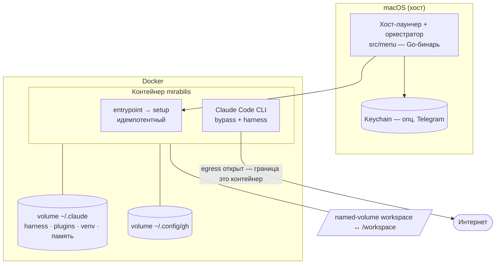

# mirabilis — Архитектура и инварианты

Единственный design-док. Что это и почему — здесь; как работать на репо — в `../AGENTS.md`;
модель угроз — в `../SECURITY.md`. История решений — в git.

## Инварианты (контракт [ВЛАДЕЛЕЦ])

Жёсткие требования; любое решение проверяется против них.

| # | Инвариант | Почему | Нюанс |
|---|---|---|---|
| **I1** | `mirabilis` — **единственная команда** | минимум ритуала; «одна команда» — суть UX | подкоманд в ежедневном флоу нет; всё делает запуск через меню |
| **I2** | Внутри можно установить/изменить **что угодно**, включая `apt` | универсальная песочница под любой стек | требует root внутри; не нарушает I5 |
| **I3** | Claude запускается с `--dangerously-skip-permissions` (**bypass**) | полная автономия — ради этого песочница | нативный `ask` под bypass не работает, и это ОК: граница = контейнер (I5/I6) |
| **I4** | Несколько окон × `mirabilis` = несколько сессий на **одном** контейнере | реальный рабочий паттерн | при здоровом окружении — идемпотентный attach; обновление останавливает контейнер и убивает все сессии (осознанно) |
| **I5** | **Изоляция хоста = надёжность**: контейнер не влияет на Mac | «надёжность» в нашей терминологии именно это | внутреннюю мутабельность не ограничивает |
| **I6** | Внутри контейнера **защиты файлов нет**: граница безопасности — **сам контейнер** | mirabilis не сторожит внутренности; bypass нужен ради автономии (I3) | поведенческие лимиты (не ломать ЧУЖОЕ: push/force в `main`, эксфильтрация кредов) — дело **харнеса neuro-matrix**, не песочницы |
| **I7** | **Fail-fast** на критическом пути | не работать в сломанном окружении | egress/Claude-токен = стоп с диагностикой; харнес опционален → варнинг (режим bare), не стоп |
| **I8** | При конфликте **простота > надёжность > безопасность-от-эксфильтрации**; воспроизводимость — не цель | приоритеты заданы владельцем | калибрует все спорные решения |
| **I9** | **Конфигурация ≠ действие** | предсказуемость: выбор не меняет систему втихую | конфиг-пункты меню пишут только декларативное состояние (плагины/харнес/стек в файлы и `.env`); применение — при старте контейнера (entrypoint → идемпотентный `refresh.sh`). Смена стека не пересобирает сразу — помечает workspace «stale → rebuild on launch» |
| **I-Telegram** | **Уведомления — только наружу**, осознанное исключение из I5 | владельцу нужен «зуммер» о готовности/вопросе, не нарушая изоляцию | один домен `api.telegram.org`, единственный `chat_id`, **односторонний** канал (`Stop` → готово, `Notification` → нужен ответ, через `sendMessage`); нет webhook/long-poll/входящего управления; токен+`chat_id` — Keychain хоста → env контейнера |

## Хост-лаунчер

`mirabilis` — один Go-бинарь (`src/menu`, Bubble Tea + Bubbles `list` + Lip Gloss + Huh). Он и
рисует меню, и **оркеструет**: Docker / `devcontainer` exec, чтение Keychain, `.env`, статус. Bash-обёртки
на хосте нет.

`mirabilis` → TUI-меню (`Запустить · Плагины · Харнес · Стек · Открыть в VS Code`). Конфиг-пункты пишут
декларативное состояние (I9). Пункт **«Запустить»** гоняет идемпотентный **пайплайн** как state-machine:

- шаги: `update → stacks → prepare`, затем `theme · harness · gh sign-in` параллельно; `preflight` ждёт `harness`+`gh`; затем `exec claude`;
- **каждый запуск проверяет каждый шаг** против реального состояния (reconciler-модель, без first-run-маркеров): `check()` удовлетворён → шаг пропускается;
- сетевые шаги обёрнуты в **retry-policy** (экспоненциальный backoff + jitter); локальные — без ретраев;
- независимые шаги идут параллельно по графу зависимостей; интерактивные (форма стека, web-логин `gh`) **сериализованы** через один TTY (`tea.ExecProcess`);
- по завершении — `syscall.Exec` заменяет процесс на in-container сессию Claude.

## Контейнер и жизненный цикл

- Единый идемпотентный **entrypoint** (`.devcontainer/entrypoint.sh` → `refresh.sh`) прогоняет per-start
  setup, поэтому любой старт (`mirabilis`, `docker compose up`, авто-рестарт Docker) поднимает контейнер
  уже настроенным. Жёсткий STOP на сломанном крит-пути делает Go-preflight (I7).
- Контейнер живёт в фоне (`restart: unless-stopped`), останавливается только при обновлении (деструктивно, I4).
- Контейнерные provisioning-скрипты (`refresh.sh`, `provision-mcp.sh`, `harness-reinstall.sh`,
  `git-identity.sh`, `entrypoint.sh`) — bash, и остаются bash: они не часть TUI.

## Файловые зоны и персистентность ([ВЛАДЕЛЕЦ])

Внутри контейнера **всё пишемо** — root, любые файлы, sudo (I2). Защита = граница контейнера + host-изоляция
(I5/I6); сломал своё окружение — рестарт пересоберёт (I4).

- **`/workspace`** — рабочая зона (вся работа, `git clone` всех репозиториев, отчёты). Это **named-volume,
  которым владеет песочница**; на хост папкой не торчит, открывается из VS Code (Dev Containers attach);
  переживает пересоздание. Раскладка свободная — конвенция папок не навязывается.
- **`/tmp`** — эфемерный скретч.
- **Всё прочее** — пишемо, но эфемерно, кроме того, что в volume’ах.

| Что | Где живёт | Переживает пересоздание |
|---|---|---|
| neuro-matrix, плагины, правила памяти `~/.claude/rules/*.md` | volume `~/.claude` (seed/обновление при старте) | да |
| python-интерпретатор, системные пакеты (`apt`) | declared-list, переустановка при старте | да |
| venv / зависимости проектов | volume / `/workspace` | да |
| ad-hoc установки | разово | нет |

Память — **глобальная**: факты про владельца в `~/.claude` + нативный per-project контекст Claude;
пер-папочной изоляции памяти нет.

## Сеть

Egress **открыт** — единственная граница это контейнер (I5/I6/I8); in-container allowlist и host-proxy
сняты. `WebFetch`/`WebSearch` идут через Anthropic API и всегда работают. Остановка эксфильтрации кредов —
поведенческая задача **харнеса**, не сетевой шлюз. Единственное исходящее исключение — односторонний
Telegram-зуммер (I-Telegram).
