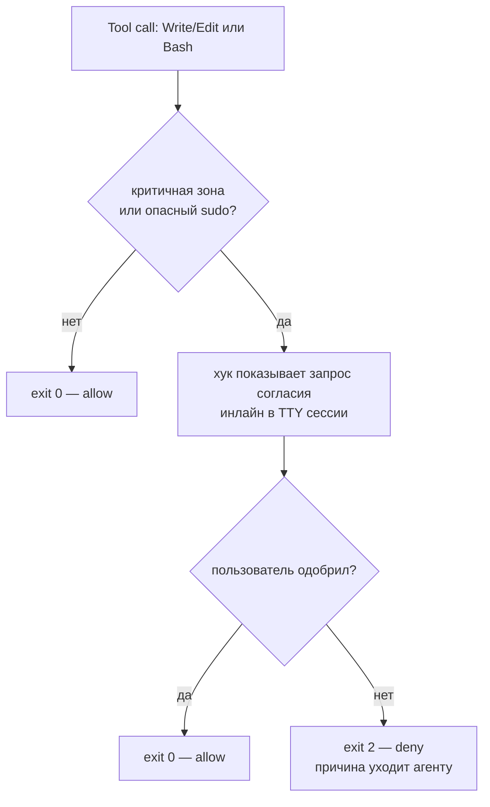

# mirabilis — Bypass и консент-гейт

> Индекс и легенда [И]/[ИИ]: [README.md](README.md). Инварианты: I3 (bypass), I6 (согласие).
> Самый тонкий механизм системы — описан честно, без костыля.

## 1. Конфликт двух инвариантов [И]

- **I3** — Claude работает с `--dangerously-skip-permissions` (полная автономия, суть песочницы).
- **I6** — критичное (всё, кроме `/workspace` и `/tmp`) меняется только с явного согласия.

На первый взгляд несовместимы: при bypass штатные промпты отключены.

## 2. Что выяснено по докам (проверено)

Из официальной документации Claude Code:
- **PreToolUse-хуки выполняются и под `--dangerously-skip-permissions`.**
- Хук с `permissionDecision: "deny"` (или `exit 2`) **блокирует вызов даже в bypass**.
- Хук с `permissionDecision: "ask"` **НЕ показывает диалог в bypass** — система пермишенов отключена,
  `ask` игнорируется.

Вывод: «нативный диалог-вопрос» под bypass **недостижим** → гейт-диалог реализует **сам хук**.

Источники (проверено): [hooks-guide](https://docs.claude.com/en/docs/claude-code/hooks-guide) ·
[hooks reference](https://docs.anthropic.com/en/docs/claude-code/hooks) ·
[settings/permissions](https://code.claude.com/docs/en/settings)

## 3. Дизайн консент-гейта [ИИ]

> Механизм предложен ассистентом как честная реализация твоего требования I6 под bypass.
> Твоё требование [И]: «хук на изменение конкретных папок/файлов + конкретные sudo → диалог
> пользователю; bypass по умолчанию, но с ограничениями, чтобы Клод сам себя не сломал».

- **Матчит:** `Write/Edit/MultiEdit` по пути (всё, кроме `/workspace`,`/tmp`) **и** `Bash` по
  содержимому (`sudo`, `apt`, запись в gated-пути). Закрывает дыру нынешнего хука (ловил только
  Write/Edit, не Bash).
- **Откуда согласие [И]:** инлайн в сессии. [ИИ]: технически — чтение `/dev/tty`; фолбэк — host-side
  диалог, если хук не получает TTY (открытый вопрос §5).
- **Пред-одобрено [ИИ]:** declared-lists (apt, плагины) на старте — гейт не дёргают (заранее
  согласованный набор).

## 4. Честность и границы [И]

- Это **guardrail** — «чтобы Клод сам себя не сломал», **не хард-граница**: матчинг Bash —
  эвристика, агент с root технически может обойти внутренний хук. Принято осознанно.
- **Настоящую изоляцию хоста (I5) даёт граница контейнера**, не этот хук.
- Заменяет нынешний `protect-critical.sh`, где «согласие» — фейковый маркер, создаваемый самим агентом.

## 5. Открытые вопросы [ИИ]

- **TTY vs host-bridge:** получает ли хук TTY сессии под Claude? Если нет — host-bridge. Проверить.
- **`deny`-набор [ИИ]-кандидаты, не подтверждены:** что запрещено **никогда** (push/force в `main`,
  вывод кредов наружу, `rm -rf` вне `/workspace`).

## 6. Почему НЕ «убрать bypass и включить permissions-политику» [ИИ]

Технически «bypass-по-умолчанию + ask на критичном» чище делается политикой `permissions` без флага
bypass. Но **bypass — инвариант I3 [И]**, поэтому идём через хук-гейт. Трейд зафиксирован осознанно
(T5 в [DECISIONS.md](DECISIONS.md)).
