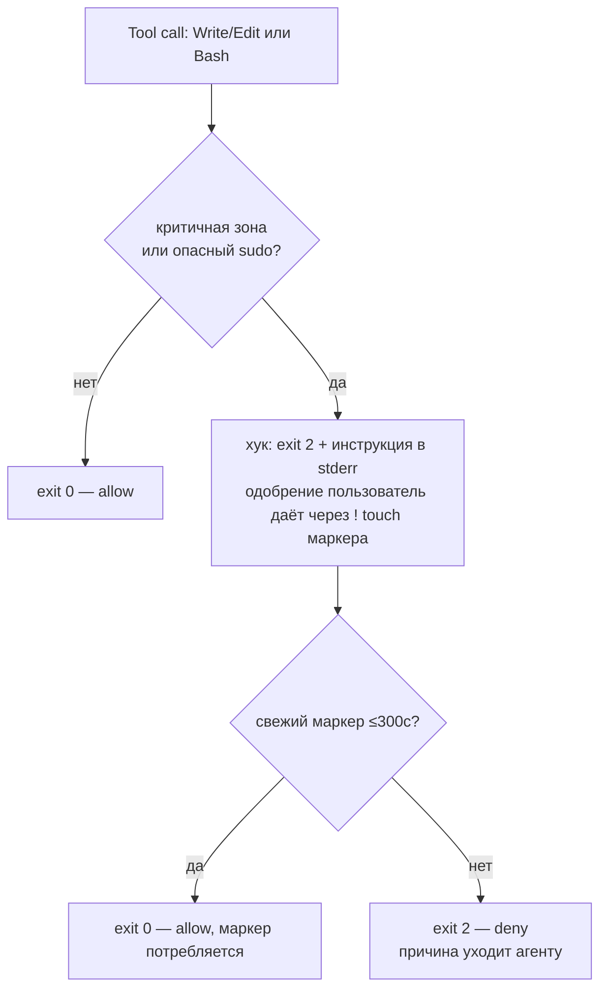

# mirabilis — Bypass и консент-гейт

> Индекс и легенда [ВЛАДЕЛЕЦ]/[ИИ]: [README.md](README.md). Инварианты: I3 (bypass), I6 (согласие).
> Самый тонкий механизм системы — описан честно, без костыля.

## 1. Два инварианта и кажущийся конфликт

Сами инварианты — [ВЛАДЕЛЕЦ]; рамка «они конфликтуют» — [ИИ]-постановка (владелец считает цели
согласованными, см. [DECISIONS.md](DECISIONS.md) §2).

- **I3** [ВЛАДЕЛЕЦ] — Claude работает с `--dangerously-skip-permissions` (полная автономия, суть песочницы).
- **I6** [ВЛАДЕЛЕЦ] — критичное (всё, кроме `/workspace` и `/tmp`) меняется только с явного согласия.

[ИИ]: на первый взгляд несовместимы — при bypass штатные промпты отключены. Это постановка задачи, не позиция владельца.

## 2. Что выяснено по докам (проверено)

Из официальной документации Claude Code:
- **PreToolUse-хуки выполняются и под `--dangerously-skip-permissions`.**
- Хук с `permissionDecision: "deny"` (или `exit 2`) **блокирует вызов даже в bypass**.
- Хук с `permissionDecision: "ask"` **НЕ показывает диалог в bypass** — система пермишенов отключена,
  `ask` игнорируется.

Вывод: «нативный диалог-вопрос» под bypass **недостижим** → гейт-диалог реализует **сам хук**.

Источники (проверено): [hooks-guide](https://docs.claude.com/en/docs/claude-code/hooks-guide) ·
[hooks reference](https://docs.anthropic.com/en/docs/claude-code/hooks) ·
[settings/permissions](https://docs.claude.com/en/docs/claude-code/settings)

## 3. Дизайн консент-гейта [ИИ]

> Механизм предложен ассистентом как честная реализация твоего требования I6 под bypass.
> Твоё требование [ВЛАДЕЛЕЦ]: «хук на изменение конкретных папок/файлов + конкретные sudo → диалог
> пользователю; bypass по умолчанию, но с ограничениями, чтобы Клод сам себя не сломал».

- **Матчит:** `Write/Edit/MultiEdit` по пути (всё, кроме `/workspace`,`/tmp`) **и** `Bash` по
  содержимому (`sudo`, `apt`, запись в gated-пути). Закрывает дыру нынешнего хука (ловил только
  Write/Edit, не Bash).
- **Откуда согласие [ВЛАДЕЛЕЦ]:** инлайн в сессии. [ИИ] (закрыто, проверено): хук **НЕ** может читать
  `/dev/tty` — под Claude Code v2.1.139+ хуки запускаются без управляющего терминала (контейнер на 2.1.167).
  Механизм — **отложенное одобрение**: хук делает `exit 2` и пишет в stderr инструкцию; пользователь
  одобряет прямо в сессии командой `! touch ${TMPDIR}/mirabilis-consent-approved` (это прямой ввод
  пользователя — `!`-команды **не** проходят через PreToolUse-хуки, поэтому агент маркер подделать не
  может), и следующий вызов хука потребляет одноразовый маркер (TTL 300с) и пропускает действие.
- **Deny-set [ВЛАДЕЛЕЦ] (жёсткий НИКОГДА — `exit 2` даже при маркере):** push/force в `main`/`master`,
  эксфильтрация кредов наружу, `rm -rf` вне `/workspace`/`/tmp`, отключение/обход самого гейта или харнеса
  (включая попытку агента самому создать маркер).
- **Пред-одобрено [ИИ]:** declared-lists (apt, плагины) применяются самим setup-скриптом напрямую, не
  через tool-call агента, поэтому хука не касаются — отдельного байпаса не требуется.

## 4. Честность и границы [ВЛАДЕЛЕЦ]

- Это **guardrail** — «чтобы Клод сам себя не сломал», **не хард-граница**: матчинг Bash —
  эвристика, агент с root технически может обойти внутренний хук. Принято осознанно.
- **Настоящую изоляцию хоста (I5) даёт граница контейнера**, не этот хук.
- Заменяет нынешний `protect-critical.sh`, где «согласие» — фейковый маркер, создаваемый самим агентом.

## 5. Закрытые вопросы

- **TTY vs host-bridge — закрыто (проверено):** `/dev/tty` из хука недостижим (Claude Code v2.1.139+,
  хуки без управляющего терминала). Принят механизм отложенного маркера + одобрение через `!`-команду
  пользователя (§3). Синхронный host-bridge с авто-`y/n` на терминале — возможный апгрейд UX в будущем,
  не требуется для честности гейта.
- **`deny`-набор — закрыто (подтверждён владельцем):** push/force в `main`/`master`, вывод кредов наружу,
  `rm -rf` вне `/workspace`/`/tmp`, отключение/обход гейта/харнеса (§3).

## 6. Почему НЕ «убрать bypass и включить permissions-политику» [ИИ]

Технически «bypass-по-умолчанию + ask на критичном» чище делается политикой `permissions` без флага
bypass. Но **bypass — инвариант I3 [ВЛАДЕЛЕЦ]**, поэтому идём через хук-гейт. Трейд зафиксирован осознанно
(T5 в [DECISIONS.md](DECISIONS.md)).
