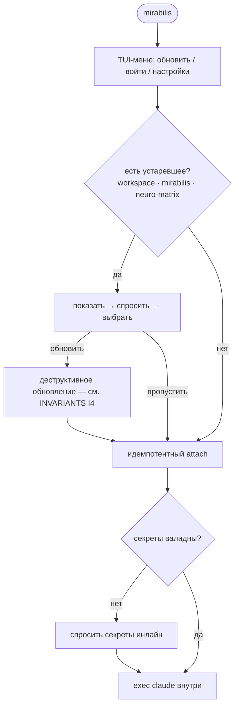
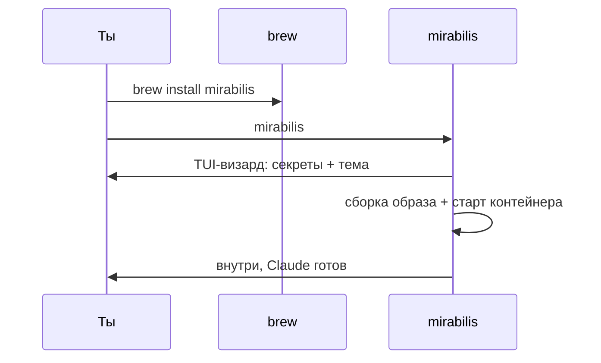
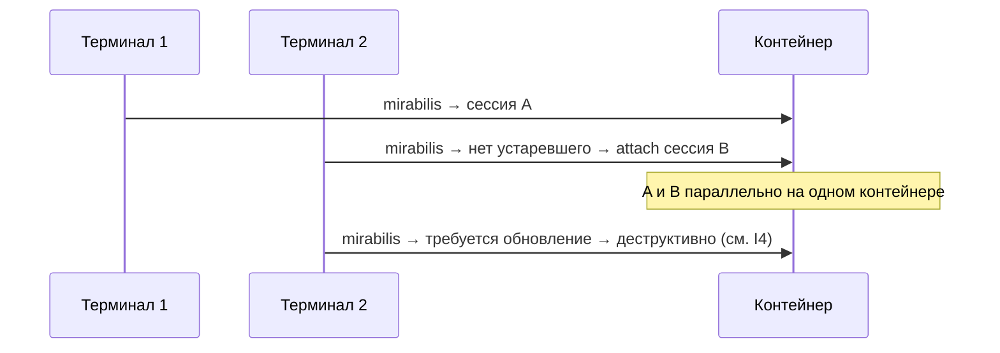

# mirabilis — Юзкейсы и пользовательские пути

> Индекс и легенда [ВЛАДЕЛЕЦ]/[ИИ]: [README.md](README.md).
> **Список юзкейсов — [ВЛАДЕЛЕЦ] (перечислены владельцем). Потоки и пути — [ИИ] (детализация ассистента).**
> **Раскладка папок [ВЛАДЕЛЕЦ]: свободная форма, конвенция `/workspace` снята.** Любые пути в таблице/потоках
> ниже — лишь [ИИ]-примеры, НЕ предписание (см. [ARCHITECTURE.md](ARCHITECTURE.md) §7).

## Сводка юзкейсов [ВЛАДЕЛЕЦ]

> Колонка «где работа» — [ИИ]-примеры; раскладка свободная (`/workspace`, любая структура). Память ГЛОБАЛЬНАЯ.

| # | Юзкейс [ВЛАДЕЛЕЦ] | Стек/инструменты | Где работа [ИИ] (пример) | Память |
|---|---|---|---|---|
| UC1 | Разработка своих проектов | мультистек по требованию | `/workspace/<repo>` | глобально |
| UC2 | Развитие **neuro-matrix** | git, харнес | дев-копия в `/workspace` → установка харнеса при старте | глобально |
| UC3 | Мультистек: Python / React / .NET | apt + user-space | `/workspace/<repo>` | глобально |
| UC4 | Подготовка к собесам | быстрый код, разные языки | свободно в `/workspace` | глобально |
| UC5 | Исследования | WebFetch, заметки | свободно в `/workspace` | глобально |
| UC6 | Изучение материалов | чтение, конспекты | свободно в `/workspace` | глобально |

Принцип «свободная песочница» [ВЛАДЕЛЕЦ]; конкретные папки — [ИИ]-примеры (см. выше). Память глобальная
(`~/.claude` + нативный per-project контекст Claude), пер-папочной изоляции нет [ВЛАДЕЛЕЦ].

## UC1 — Разработка своих проектов [ВЛАДЕЛЕЦ]
- **Триггер:** новый/существующий проект.
- **Поток [ИИ]:** внутри `git clone` в `/workspace` → при необходимости поставить стек (ad-hoc,
  `sudo` свободен — root внутри контейнера, I2) → разработка → коммиты/PR (поведенческие
  лимиты вроде «не в `main`» — дело харнеса neuro-matrix, не песочницы).

## UC2 — Развитие neuro-matrix (харнес) [ВЛАДЕЛЕЦ]
- **Поток [ИИ]:** правка dev-копии в `/workspace` → мерж в репозиторий neuro-matrix →
  `mirabilis` рестарт подтягивает свежее (харнес ставится/обновляется на старте). *Это твой сценарий
  («перезапускать буду после мержа»); разделение dev-копия/активный харнес — [ИИ].*

## UC3 — Мультистек (Python / React / .NET) [ВЛАДЕЛЕЦ]
- **Поток [ИИ]:** Python — интерпретатор из apt-list + venv в проекте (оба уровня, F1); React — node
  есть; .NET — dotnet SDK по требованию ([ИИ]: через MS-feed в allowlist, `sudo` свободен внутри, I2).

## UC4 — Подготовка к собеседованиям [ВЛАДЕЛЕЦ]
- **Поток [ИИ]:** быстрый код в `/workspace` (раскладка свободная); память глобальная.

## UC5 — Исследования [ВЛАДЕЛЕЦ]
- **Поток [ИИ]:** чтение через `WebFetch`; отчёты/заметки свободно в `/workspace`.

## UC6 — Изучение материалов [ВЛАДЕЛЕЦ]
- **Поток [ИИ]:** конспекты/эксперименты свободно в `/workspace`; память глобальная.

## Пользовательские пути [ИИ] (визуализация твоих решений)

### Запуск (ежедневный)

### Day-1 (новый пользователь) — [ВЛАДЕЛЕЦ] (решение) + [ИИ] (детализация)

### Мультисессии (I4) [ВЛАДЕЛЕЦ]

Правило деструктивного обновления — в [INVARIANTS.md](INVARIANTS.md) I4 (здесь не дублируется).
