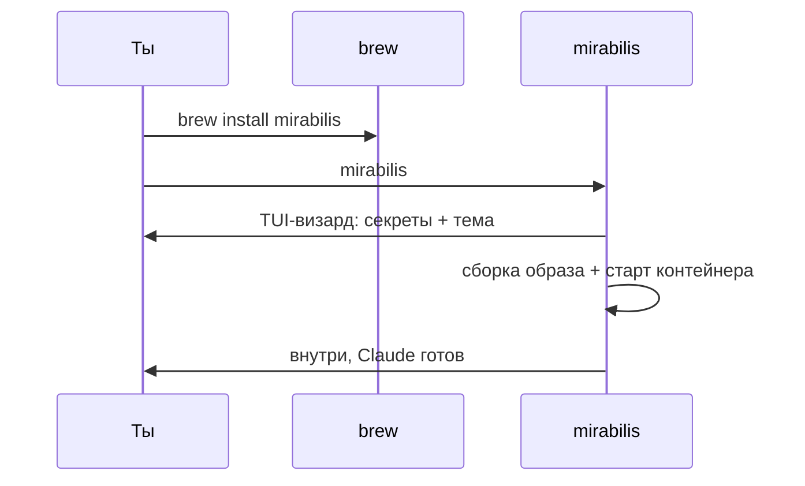
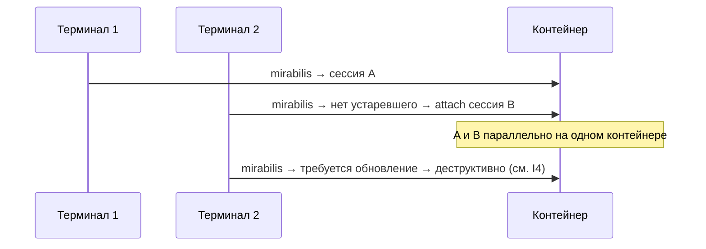

# mirabilis — Юзкейсы и пользовательские пути

> Индекс и легенда [ВЛАДЕЛЕЦ]/[ИИ]: [README.md](README.md).
> **Список юзкейсов — [ВЛАДЕЛЕЦ] (перечислены владельцем). Потоки и пути — [ИИ] (детализация ассистента).**
> **Пути папок (`projects/`, `research/`…) — [ИИ], предложенная конвенция, НЕ подтверждена**
> (см. [ARCHITECTURE.md](ARCHITECTURE.md) §7).

## Сводка юзкейсов [ВЛАДЕЛЕЦ]

> Колонка «где работа» использует [ИИ]-конвенцию папок (не подтверждена).

| # | Юзкейс [ВЛАДЕЛЕЦ] | Стек/инструменты | Где работа [ИИ] | Память |
|---|---|---|---|---|
| UC1 | Разработка своих проектов | мультистек по требованию | `projects/<repo>` | по проекту |
| UC2 | Развитие **neuro-matrix** | git, харнес | `neuro-matrix/` → gated установка | по проекту + глобально |
| UC3 | Мультистек: Python / React / .NET | apt + user-space | `projects/<repo>` | по проекту |
| UC4 | Подготовка к собесам | быстрый код, разные языки | `interview/<topic>` | по папке |
| UC5 | Исследования | WebFetch, заметки | `research/<topic>` | по папке |
| UC6 | Изучение материалов | чтение, конспекты | `learning/<topic>` | по папке |

Принцип «структурированная песочница» [ВЛАДЕЛЕЦ]; конкретные папки [ИИ] (см. выше).

## UC1 — Разработка своих проектов [ВЛАДЕЛЕЦ]
- **Триггер:** новый/существующий проект.
- **Поток [ИИ]:** внутри `git clone` в `/workspace` → при необходимости поставить стек (ad-hoc,
  `sudo` через гейт) → разработка → коммиты/PR (никогда не в `main`).

## UC2 — Развитие neuro-matrix (харнес) [ВЛАДЕЛЕЦ]
- **Поток [ИИ]:** правка dev-копии в `/workspace` (free) → мерж в репозиторий neuro-matrix →
  `mirabilis` рестарт подтягивает свежее (харнес — gated, обновляется на старте). *Это твой сценарий
  («перезапускать буду после мержа»); разделение dev-копия/активный харнес — [ИИ].*

## UC3 — Мультистек (Python / React / .NET) [ВЛАДЕЛЕЦ]
- **Поток [ИИ]:** Python — интерпретатор из apt-list + venv в проекте (оба уровня, F1); React — node
  есть; .NET — dotnet SDK по требованию ([ИИ]: через MS-feed в allowlist, `sudo` через гейт).

## UC4 — Подготовка к собеседованиям [ВЛАДЕЛЕЦ]
- **Поток [ИИ]:** `interview/<topic>`, быстрый код; память по папке, не смешивается с проектами.

## UC5 — Исследования [ВЛАДЕЛЕЦ]
- **Поток [ИИ]:** чтение через `WebFetch`; отчёты/заметки в `research/<topic>`.

## UC6 — Изучение материалов [ВЛАДЕЛЕЦ]
- **Поток [ИИ]:** конспекты/эксперименты в `learning/<topic>`; память по папке.

## Пользовательские пути [ИИ] (визуализация твоих решений)

### Запуск (ежедневный)

### Day-1 (новый пользователь) — [ВЛАДЕЛЕЦ] (решение) + [ИИ] (детализация)

### Мультисессии (I4) [ВЛАДЕЛЕЦ]

Правило деструктивного обновления — в [INVARIANTS.md](INVARIANTS.md) I4 (здесь не дублируется).
