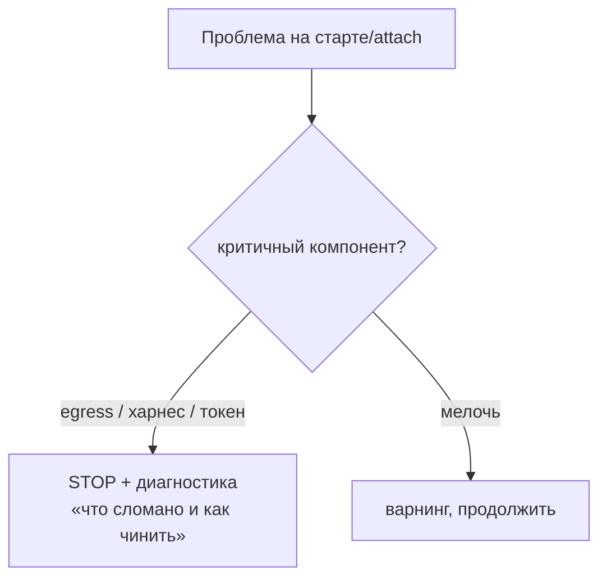

# mirabilis — UX

> Индекс и легенда [ВЛАДЕЛЕЦ]/[ИИ]: [README.md](README.md). Потоки целиком — [USECASES.md](USECASES.md).
> Решения UX — **[ВЛАДЕЛЕЦ]**; конкретные детали оформления — **[ИИ]**.

## 1. Запуск: TUI-меню [ВЛАДЕЛЕЦ]

Каждый `mirabilis` открывает **TUI-меню** (`gum` [ИИ]-выбор инструмента): **обновить / войти / настройки**.

- **Подсветка устаревшего [ВЛАДЕЛЕЦ]:** меню показывает, что устарело — **workspace** (контейнер из старого
  mirabilis), **сам mirabilis** (репо позади origin), **neuro-matrix**. По каждому — спросить и
  **дать выбрать**.
- **Обновление деструктивно:** правило — в [INVARIANTS.md](INVARIANTS.md) I4 (здесь не дублируется).

## 2. Настройки (в меню) [ВЛАДЕЛЕЦ]

Только **секреты + тема**. Всё остальное (allowlist, declared-lists) — через файлы/консент, не через
меню (KISS).

## 3. Секреты [ВЛАДЕЛЕЦ]

- `gh` / `claude` / `context7` — спрашиваются **при запуске**, если отсутствуют/протухли.
- Отдельной подкоманды нет (I1); первичный ввод — в TUI-визарде Day-1; хранение — Keychain хоста.

## 4. Согласие (консент-гейт) [ВЛАДЕЛЕЦ]

- **Инлайн в сессии:** запрос y/n прямо в диалоге. Механизм — [CONSENT.md](CONSENT.md).

## 5. Ошибки: fail-fast (I7), зависит от компонента (F3) [ВЛАДЕЛЕЦ]

- Критичное (egress / харнес / токен) → **стоп** с диагностикой даже при тёплом attach.
- Мелочи → варнинг.
- [ИИ]: это разворачивает нынешний «`|| true` повсюду» (находки H1/M-серии, [AUDIT.md](AUDIT.md)).

## 6. Статус-строка [ИИ]

`ccstatusline` показывает рабочий контекст (модель / контекст / ветка / здоровье). *Конкретный
инструмент и состав строки — предложение ассистента; владельцем не оговаривались.*

## 7. Принципы UX [ВЛАДЕЛЕЦ]

- **KISS** — одна команда, одно меню, минимум вопросов в обычном потоке.
- **Честность** — ошибки видны и понятны.
- **Без прерываний по пустякам** — гейт и варнинги только там, где реально нужно.
