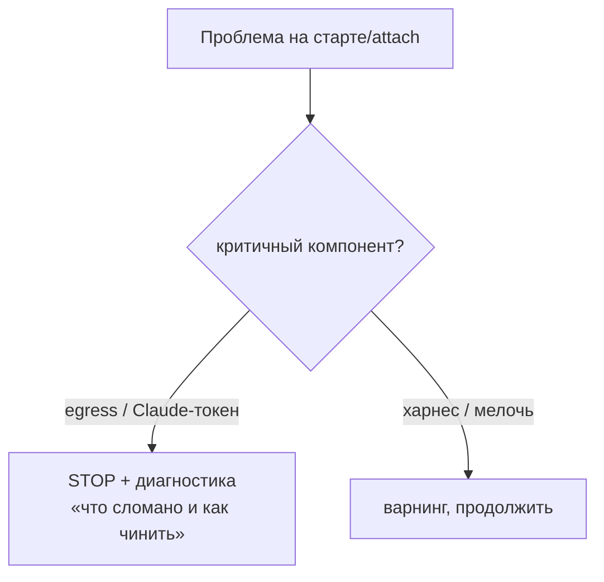

# mirabilis — UX

> Индекс и легенда [ВЛАДЕЛЕЦ]/[ИИ]: [README.md](README.md). Потоки целиком — [USECASES.md](USECASES.md).
> Решения UX — **[ВЛАДЕЛЕЦ]**; конкретные детали оформления — **[ИИ]**.

## 1. Запуск: TUI-меню [ВЛАДЕЛЕЦ]

Каждый `mirabilis` открывает **TUI-меню** (Go: Bubble Tea + Bubbles `list` + Huh —
[ИИ]-выбор инструмента; `gum` убран):
**запустить · обновить · плагины · харнес (вкл/выкл/переустановка) · стек · открыть в VS Code ·
войти+секреты (вкл. Telegram) · тема · выход**.

- **Подсветка устаревшего [ВЛАДЕЛЕЦ]:** меню показывает, что устарело — **workspace** (контейнер из старого
  mirabilis), **сам mirabilis** (репо позади origin), **neuro-matrix**. По каждому — спросить и
  **дать выбрать**.
- **Обновление деструктивно:** правило — в [INVARIANTS.md](INVARIANTS.md) I4 (здесь не дублируется).

## 2. Настройки (в меню) [ВЛАДЕЛЕЦ]

В меню — **секреты + тема** и **предвыбор предустановки**: плагины, харнес, опциональные стеки
(выбор «как плагины» [ИИ] — реализовано в #33/#34). Тонкая конфигурация (allowlist egress,
declared-lists apt) остаётся **через файлы**, не через меню (KISS).

[ИИ] (I9): пункты меню пишут только декларативное состояние; применение — при старте контейнера,
не в момент выбора. Импорт файлов отдельным пунктом снят — файлы заносятся правкой `/workspace`
через VS Code attach (пункт «открыть в VS Code»).

## 3. Секреты [ВЛАДЕЛЕЦ]

- `gh` / `claude` / `context7` / **Telegram (bot-token + один `chat_id`)** — спрашиваются
  **при запуске**, если отсутствуют/протухли (Telegram опционален — без него зуммер выключен).
- Отдельной подкоманды нет (I1); первичный ввод — в TUI-визарде Day-1; хранение — Keychain хоста.

## 4. Свобода внутри контейнера, лимиты — у харнеса [ВЛАДЕЛЕЦ]

- **Никакого консент-гейта на запись.** Внутри контейнера Клод делает что угодно (I2):
  root, любые файлы, sudo. Граница безопасности — **сам контейнер + host-изоляция** (I5),
  а не запросы y/n по каждому файлу. Сломал своё окружение — рестарт пересоберёт.
- **Поведенческие лимиты — дело харнеса** [neuro-matrix](https://github.com/AlexShchuka/neuro-matrix)
  (его инварианты + хуки), не песочницы mirabilis: не ломать чужое (push/force в `main`),
  не эксфильтрировать креды наружу. Это другой репозиторий; mirabilis в его внутренности
  не лезет — лишь устанавливает его как харнес и fail-fast'ит на хосте, если его нет (§5).

## 5. Ошибки: fail-fast (I7), зависит от компонента (F3) [ВЛАДЕЛЕЦ]

- Критичное (egress / Claude-токен) → **стоп** с диагностикой даже при тёплом attach; **харнес опционален** → варнинг, не стоп (режим bare).
- Мелочи → варнинг.
- [ИИ]: это разворачивает нынешний «`|| true` повсюду» (находки H1/M-серии, [AUDIT.md](AUDIT.md)).

## 6. Статус-строка [ИИ]

`ccstatusline` показывает рабочий контекст (модель / контекст / ветка / здоровье). *Конкретный
инструмент и состав строки — предложение ассистента; владельцем не оговаривались.*

## 7. Принципы UX [ВЛАДЕЛЕЦ]

- **KISS** — одна команда, одно меню, минимум вопросов в обычном потоке.
- **Честность** — ошибки видны и понятны.
- **Без прерываний по пустякам** — варнинги только там, где реально нужно; внутри контейнера
  работа Клода ничем не гейтится.
