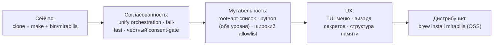

# mirabilis — Vision

> Индекс и легенда провенанса ([ВЛАДЕЛЕЦ]/[ИИ]): [README.md](README.md). Контракт: [INVARIANTS.md](INVARIANTS.md).
> Разделы 1–5 — **[ВЛАДЕЛЕЦ]** (формулировки владельца), если не помечено иначе. Роадмап (§6) — **[ИИ]**.

## 1. Вижн [ВЛАДЕЛЕЦ]

**mirabilis — это локальная изолированная песочница, единственная задача которой — запускать
Claude Code с полной автономией.** Модельно — как воркспейс Coder на изолированной машине, но
**локально, в Docker-контейнере на macOS**.

Ценность в одной фразе: **одна команда поднимает изолированную коробку, внутри которой Claude
работает без тормозов и без права навредить твоему компьютеру.**

Философия: **KISS · open-source · личное пользование.** Не продукт на продажу.

```mermaid
flowchart LR
  U([Ты на macOS]) -->|одна команда: mirabilis| L[Хост-лаунчер]
  L --> C{{Изолированный контейнер}}
  C --> CL[Claude Code\nполная автономия]
  CL --> W[/workspace — твоя работа/]
  C -. граница контейнера .-> M([(твой Mac защищён)])
```

## 2. Для кого и зачем [ВЛАДЕЛЕЦ]

Один пользователь (владелец), множество видов деятельности — это и есть **универсальность**:
разработка проектов, развитие neuro-matrix, мультистек (Python/React/.NET), подготовка к
собеседованиям, исследования, изучение материалов. Сценарии — [USECASES.md](USECASES.md).

## 3. Не-цели [ВЛАДЕЛЕЦ]

- **Не продакшн / не SaaS.** Личный OSS-инструмент.
- **Не multi-user.** Масштаб — *по коду и протоколу*, не по числу пользователей.
- **Не мульти-хост.** Цель — macOS; зависимости от Keychain / `open` / brew допустимы.
- **Воспроизводимость сборки байт-в-байт — не цель** (бонус, не инвариант).

## 4. Принципы

- **Простота важнее всего при конфликте** [ВЛАДЕЛЕЦ] (приоритеты — [INVARIANTS.md](INVARIANTS.md) I8).
- **Надёжность = изоляция хоста** [ВЛАДЕЛЕЦ], а не неизменяемость контейнера.
- **Структурированная песочница** [ВЛАДЕЛЕЦ] (принцип) — разные активности в разных папках, без хаоса;
  конкретная конвенция папок — [ИИ], не подтверждена (см. [ARCHITECTURE.md](ARCHITECTURE.md) §7).
- **Без костылей** [ВЛАДЕЛЕЦ] — честные механизмы вместо имитаций (пример — консент-гейт, [CONSENT.md](CONSENT.md)).

## 5. Север (north star) [ВЛАДЕЛЕЦ]

Позже mirabilis — это **приложение**: `brew install mirabilis` или CLI-бинарь, а не клон репозитория.
Текущее `git clone + make` — переходный мост. Дистрибуция — KISS, OSS, личное пользование.

## 6. Роадмап [ИИ]

> Этапность предложена ассистентом из находок аудита; владельцем как план не утверждалась.



## 7. Открытые вопросы ([ИИ]; часть закрыта PR «coherent box»)

- [x] Консент-диалог: TTY vs host-bridge — **закрыто** (хук не имеет управляющего терминала, Claude Code
  v2.1.139+; принят механизм отложенного маркера, [CONSENT.md](CONSENT.md) §3/§5).
- [x] Финальный `deny`-набор — **подтверждён владельцем**: push/force в `main`/`master`, вывод кредов
  наружу, `rm -rf` вне `/workspace`/`/tmp`, отключение/обход гейта/харнеса.
- [x] Формат declared-list + allowlist реестров — **v1 задан**: `config/apt-packages.txt` + домены
  PyPI/npm/NuGet/.NET/debian в `config/settings.json`.
- [x] **Переход к I1:** подкоманды `update/down/restart/token/check` свёрнуты — единственная команда
  `mirabilis` открывает меню.
- [~] Конвенция структуры `/workspace`: владелец выбрал «папки да, память **глобальная**»; набор папок
  (`projects/neuro-matrix/research/interview/learning`) зашит как рабочая конвенция в agent-заметку
  ([ARCHITECTURE.md](ARCHITECTURE.md) §7). Финальное закрепление как [ВЛАДЕЛЕЦ] — по желанию.
- [ ] Дистрибуция: `brew`-формула / упаковка — **отложено на следующий PR** (clone+make остаётся мостом).
- [ ] Бэкап/синк `/workspace` и памяти за пределами bind-mount.
