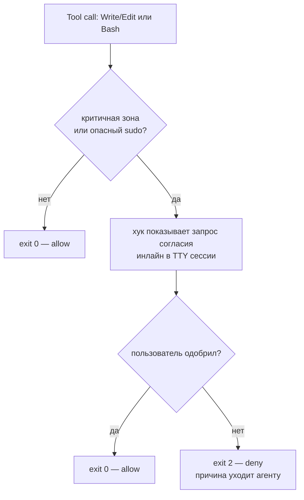
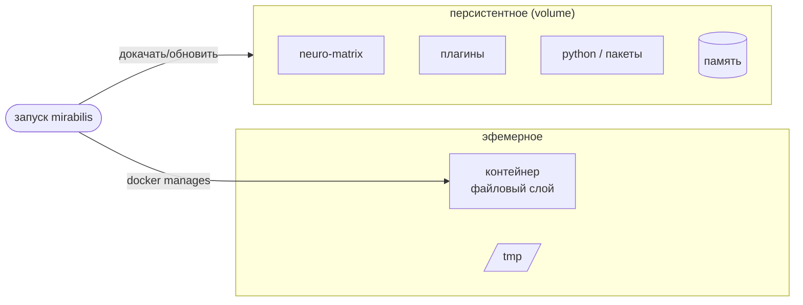
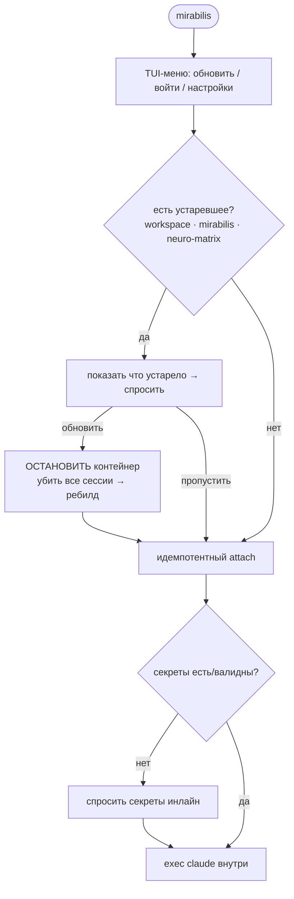
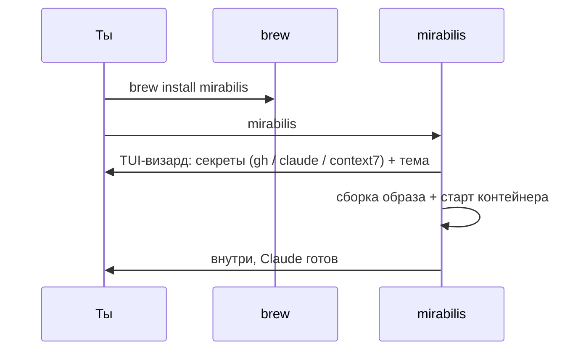
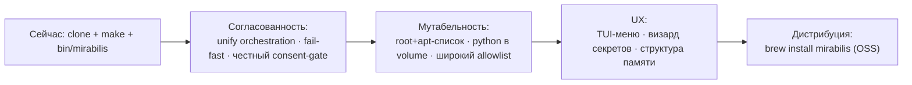

# mirabilis — Vision & Specification

> Живой документ. Описывает **целевую** систему (vision) и её **спецификацию** (инварианты,
> архитектура, юзкейсы, потоки). Где поведение отличается от текущего кода — это помечено
> `[текущее]` / `[цель]`. Документ — основа для развития продукта; меняется только осознанно.
>
> Статус: draft v1 · язык: RU · диаграммы: Mermaid.

---

## 1. Вижн

**mirabilis** — это **локальная изолированная песочница, единственная задача которой — запускать
Claude Code с полной автономией**. По модели это как воркспейс Coder на изолированной машине, но
**локально, в Docker-контейнере на macOS**.

Философия: **KISS · open-source · личное пользование**. Не продукт на продажу, не SaaS — личный
инструмент, которым не страшно поделиться как OSS.

Ценность в одной фразе: **одна команда поднимает изолированную коробку, внутри которой Claude
работает без тормозов и без права навредить твоему компьютеру.**

```mermaid
flowchart LR
  U([Ты на macOS]) -->|одна команда: mirabilis| L[Хост-лаунчер]
  L --> C{{Изолированный контейнер}}
  C --> CL[Claude Code\n--dangerously-skip-permissions]
  CL --> W[/workspace — твоя работа/]
  C -. граница контейнера .-> M([(твой Mac защищён)])
```

## 2. Не-цели (Non-goals)

- **Не продакшн / не SaaS.** Личный OSS-инструмент.
- **Не multi-user.** Масштаб — *по коду и протоколу*, не по числу пользователей.
- **Не мульти-хост.** Цель — macOS. Зависимости от Keychain / `open` / brew допустимы.
- **Воспроизводимость сборки байт-в-байт — не цель** (приятный бонус, не инвариант).

## 3. Персоны и юзкейсы

Один пользователь (владелец), множество видов деятельности — это и есть **универсальность**:

| Юзкейс | Что нужно от песочницы |
|---|---|
| Разработка своих проектов | мультистек, git, инструменты по требованию |
| Развитие **neuro-matrix** (харнес) | правка в `/workspace` → мерж → рестарт подтягивает свежее |
| Мультистек: Python / React / .NET | установка стеков (вкл. системные пакеты), реестры доступны |
| Подготовка к собеседованиям | быстрый код на разных языках, чистые рабочие папки |
| Исследования | чтение (WebFetch), сохранение отчётов в `/workspace` |
| Изучение материалов | заметки/конспекты, структурированно, без хаоса |

**Принцип «структурированная песочница»:** разные активности живут в разных папках; память —
гибридная (глобальное про тебя + контекст по папке/проекту); песочница помогает держать порядок,
а не копить мусор.

## 4. Инварианты (контракт системы)

Это **жёсткие требования**. Любое решение проверяется против них.

- **I1 — Одна команда.** `mirabilis` — единственная команда. Никаких `update`/`down`/`restart`/`token`
  как части ежедневного флоу; всё, что нужно, делает сам запуск.
- **I2 — Мутабельность внутри.** Внутри контейнера можно установить/изменить **что угодно**, включая
  системные пакеты (`apt`) → внутри доступен **root**.
- **I3 — Полная автономия.** Claude запускается с `--dangerously-skip-permissions` (bypass) —
  это **суть песочницы**, не подлежит снятию.
- **I4 — Мультисессийность.** Несколько окон терминала × `mirabilis` = несколько сессий Claude на
  **одном** контейнере; работает так же стабильно, как одна сессия.
- **I5 — Изоляция хоста = надёжность.** Контейнер **не влияет на хост-компьютер** (Mac). Это и есть
  «надёжность» в нашей терминологии.
- **I6 — Гейт на критичное.** Несмотря на bypass, изменение **критичных** объектов (системные файлы,
  плагин/харнес, креды) и опасные `sudo` — только с **явного согласия** пользователя.
- **I7 — Fail-fast.** Сломанный критический путь (egress / харнес / токен) → стоп с понятной
  диагностикой, а не «тихо продолжить».
- **I8 — Простота > всего остального при конфликте.** Приоритеты: простота + надёжность(изоляция) +
  универсальность. Безопасность-от-эксфильтрации и repo-репродьюсибилити — ниже.

## 5. Архитектура

### 5.1 Компоненты

```mermaid
flowchart TB
  subgraph HOST["macOS (хост)"]
    LCH[Хост-лаунчер mirabilis\nbin/mirabilis]
    PRX[Egress-прокси\ntinyproxy]
    KC[(Keychain — секреты)]
    APR[Approval-канал\nдиалог согласия]
  end
  subgraph DOCKER["Docker"]
    subgraph CT["Контейнер mirabilis"]
      ENT[entrypoint → setup\nidempotent]
      CLAUDE[Claude Code CLI\nbypass + harness]
      HOOKS[PreToolUse-хуки\nconsent-gate]
      direction TB
    end
    VOL[("volume: ~/.claude\nharness · plugins · python · память")]
    GHV[("volume: ~/.config/gh")]
  end
  WS[/host: ~/mirabilis (bind) ↔ /workspace/]

  LCH --> ENT
  LCH --> PRX
  LCH --> KC
  CLAUDE --> HOOKS
  HOOKS -. критичное .-> APR
  CT --- VOL
  CT --- GHV
  CT --- WS
  CLAUDE -->|HTTP(S)_PROXY| PRX
  PRX --> NET([Интернет: allowlist реестров])
```

### 5.2 Оркестрация `[цель]`

Единый путь жизненного цикла. Сейчас он расщеплён (devcontainer CLI vs `docker compose` vs
Docker auto-restart), и только один путь запускает per-start setup — это **главный архитектурный
долг** `[текущее]`. Цель:

- **Setup переносится в entrypoint контейнера** (идемпотентный скрипт), чтобы любой способ старта
  (`mirabilis`, авто-рестарт Docker, ребут хоста) поднимал контейнер **уже настроенным**.
- Контейнер **остаётся запущенным** в фоне (Docker управляет ресурсами); останавливается только при
  обновлении. `restart: unless-stopped` сохраняется (даёт персистентность), а класс багов
  «поднялся без настройки» закрывается entrypoint'ом.

## 6. Файловые зоны и мутабельность

Ты видишь простую структуру верхнего уровня:

```mermaid
flowchart LR
  subgraph FREE["свободно — без спроса"]
    WS[/workspace/\nвся работа, репозитории, отчёты]
    TMP[/tmp/\nэфемерный скретч]
  end
  subgraph GATED["только с согласия (I6)"]
    SYS[системные файлы\n/usr /etc ...]
    PLG[плагин / харнес\nneuro-matrix]
    CRD[креды\n~/.claude, ~/.config/gh]
  end
```

- **`/workspace`** — **free**. Сюда `git clone` всех репозиториев, файлы, отчёты, заметки. Живёт на
  хосте как **одна общая папка** (bind-mount) — видна и в редакторе macOS, и внутри. Переживает всё.
- **`/tmp`** — **free**, эфемерно.
- **Всё прочее** — **gated**: меняется только через консент-гейт (см. §7).

Мутабельность достигается так:
- **python / пакеты пользователя** — в персистентный volume `~/.claude` (переживают рестарт).
- **системные пакеты (`apt`)** — **декларативным списком**, применяется при старте (как плагины);
  переживают пересоздание контейнера. Ad-hoc `apt` — возможен (root есть), но проходит через гейт.
- **плагины** — `claude plugin install` (volume); преустановка уже есть `[текущее]`, расширяем.
- База — **минимум + по требованию**. Стек — **глобальный список + ad-hoc «прошу Клода»**.

## 7. Консент-гейт (дизайн)

**Проблема.** I3 (bypass) и I6 (согласие на критичное) на первый взгляд конфликтуют: под
`--dangerously-skip-permissions` система пермишенов отключена, поэтому **нативный `ask`-диалог не
показывается** — работает только хук-`deny` (подтверждено в офиц. доках Claude Code).

**Разрешение (без костыля).** Консент-гейт — это **PreToolUse-хук**, который:



- Матчит: `Write/Edit/MultiEdit` по пути (gated-зоны) **и** `Bash` по содержимому (`sudo`, `apt`,
  запись в gated-пути). Закрывает дыру нынешнего хука, который ловил только Write/Edit, не Bash.
- Подтверждение приходит из канала, **который агент не может подделать**: инлайн-чтение `/dev/tty`
  сессии (соответствует выбранному UX «инлайн в сессии»); фолбэк — host-side диалог.
- Это **guardrail** («чтобы Клод сам себя не сломал»), **не хард-граница**: матчинг Bash —
  эвристика. Настоящую изоляцию хоста (I5) обеспечивает **граница контейнера**, не этот хук.
- Заменяет нынешний `protect-critical.sh`, где «согласие» — фейковый маркер, который агент создаёт сам.

> Открытый вопрос реализации: получает ли хук доступ к TTY сессии под Claude. Если нет — host-bridge
> (хук сигналит хост-лаунчеру, тот показывает диалог `gum`/`osascript`). См. §15.

## 8. Сеть

- **Чтение/research** — через `WebFetch`/`WebSearch` Клода (идут по Anthropic API, всегда работают).
- **Установка пакетов** — `WebFetch` тут **не помогает**; `pip`/`nuget`/`apt`/`npm` нужен прямой
  доступ к реестрам. Поэтому в allowlist входят реестры: pypi, nuget, deb.debian.org,
  packages.microsoft.com и т.п. Новые хосты добавляются **ad-hoc через консент-гейт**.
- Изоляция (I5) — про **файлы хоста**, а не про сеть. Широкий сетевой доступ изнутри хост не задевает.

## 9. Окружение и персистентность



- Контейнер эфемерный; **persistent volume** несёт мутабельную среду (neuro-matrix, плагины, python,
  память) и **обновляется при запуске**.
- `apt`-пакеты — декларативным списком, применяются при старте (переживают пересоздание).

## 10. Память

**Гибрид:**
- **Глобально** — факты про тебя/предпочтения (общие для всех сессий).
- **По проекту/папке** — рабочий контекст (`~/.claude/projects/<repo>`). Собес ≠ проект ≠ research.

Цель — структура и отсутствие хаоса/мусора на уровне песочницы.

## 11. Пользовательские пути

### 11.1 Запуск (ежедневный)



### 11.2 Day-1 (новый пользователь) `[цель]`



### 11.3 Прочие пути (коротко)

- **Новый проект:** внутри `git clone` в `/workspace` → «поставь стек» (гейт на `sudo`) → работа.
- **Развитие харнеса:** правка `/workspace/neuro-matrix` → мерж в репо neuro-matrix → `mirabilis`
  рестарт подтягивает свежее.
- **Мультисессии:** несколько окон → несколько сессий на одном контейнере; обновление
  останавливает контейнер и убивает все сессии (осознанно), иначе — просто attach.

## 12. UX

- **Запуск:** TUI-меню (`gum`) — обновить / войти / настройки.
- **Настройки (в меню):** только **секреты + тема**. allowlist/пакеты — через файлы/консент.
- **Согласие:** инлайн-диалог в сессии (см. §7).
- **Ошибки:** **fail-fast** (I7) — стоп + «что сломано и как чинить».
- **Статус:** строка статуса (модель/контекст/ветка/здоровье) — `ccstatusline`.

## 13. Секреты

- `gh` / `claude` / `context7` — спрашиваются **при запуске**, если отсутствуют/протухли.
- Отдельной команды нет (I1); первичный ввод — в TUI-визарде; хранение — Keychain хоста.

## 14. Изоляция / модель угроз

- **Доверенный код, граница = контейнер.** Внутри — полная автономия (I3); наружу (на Mac) — нельзя.
- Проверено probe'ом в работающем контейнере `[текущее]`: пользователь `node` (не root по умолчанию),
  `/usr` и `/opt/mirabilis` — read-only, `~/.claude` — writable (volume). Для I2 (root/apt) внутренние
  ограничения ослабляются **намеренно и только внутри** — граница контейнера остаётся.
- Эгресс — через хост-прокси; сетевой доступ хост не задевает (§8).

## 15. Снятые противоречия (журнал)

| # | Противоречие | Разрешение |
|---|---|---|
| T1 | root внутри vs консент-гейт | гейт = guardrail (хук-deny + свой диалог), не хард-граница; изоляцию даёт контейнер |
| T2 | `apt` vs персистентность | системные пакеты — декларативным списком, применяются при старте |
| T3 | обновление vs живые сессии | обновление **останавливает** контейнер и убивает сессии (осознанно); иначе идемпотентный attach |
| T4 | WebFetch vs установка пакетов | реестры (pypi/nuget/debian/MS) в allowlist + ad-hoc через гейт |
| T5 | bypass (I3) vs диалог-согласие (I6) | под bypass нативный `ask` мёртв → гейт-диалог реализует **хук** сам (deny + свой prompt) |

## 16. Открытые вопросы / TODO

- [ ] Реализация консент-диалога: TTY сессии vs host-bridge (см. §7) — проверить доступ хука к TTY.
- [ ] Точный allowlist реестров пакетов (и формат «список + ad-hoc»).
- [ ] Финальный `deny`-набор (что нельзя **никогда**, даже с согласия) — обсуждается.
- [ ] Перенос setup в entrypoint (унификация оркестрации, §5.2).
- [ ] Декларативные списки: формат файла для `apt`-пакетов / стеков / плагинов.
- [ ] Дистрибуция: `brew`-формула / упаковка (§17).
- [ ] Бэкап/синк `/workspace` и памяти (за пределами bind-mount).

## 17. Роадмап



Север: позже mirabilis — это **приложение** (`brew`/CLI), а не клон репозитория. Текущее
`clone + make` — переходный мост.

---

### Приложение A — Терминология

- **harness / neuro-matrix** — протокол-надстройка над Claude (инварианты, хуки, агенты), живёт как
  плагин в gated-зоне, разрабатывается как отдельный репозиторий.
- **gated-зона** — всё, что меняется только с согласия (§6).
- **консент-гейт** — PreToolUse-хук, реализующий запрос согласия под bypass (§7).
- **declared list** — декларативный список (apt-пакеты / стеки / плагины), применяемый при старте.
