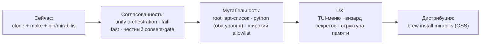

# mirabilis — Vision

> Индекс и легенда провенанса ([И]/[ИИ]): [README.md](README.md). Контракт: [INVARIANTS.md](INVARIANTS.md).
> Разделы 1–5 — **[И]** (формулировки владельца), если не помечено иначе. Роадмап (§6) — **[ИИ]**.

## 1. Вижн [И]

**mirabilis — это локальная изолированная песочница, единственная задача которой — запускать
Claude Code с полной автономией.** Модельно — как воркспейс Coder на изолированной машине, но
**локально, в Docker-контейнере на macOS**.

Ценность в одной фразе: **одна команда поднимает изолированную коробку, внутри которой Claude
работает без тормозов и без права навредить твоему компьютеру.**

Философия: **KISS · open-source · личное пользование.** Не продукт на продажу.

```mermaid
flowchart LR
  U([Ты на macOS]) -->|одна команда: mirabilis| L[Хост-лаунчер]
  L --> C{{Изолированный контейнер}}
  C --> CL[Claude Code\nполная автономия]
  CL --> W[/workspace — твоя работа/]
  C -. граница контейнера .-> M([(твой Mac защищён)])
```

## 2. Для кого и зачем [И]

Один пользователь (владелец), множество видов деятельности — это и есть **универсальность**:
разработка проектов, развитие neuro-matrix, мультистек (Python/React/.NET), подготовка к
собеседованиям, исследования, изучение материалов. Сценарии — [USECASES.md](USECASES.md).

## 3. Не-цели [И]

- **Не продакшн / не SaaS.** Личный OSS-инструмент.
- **Не multi-user.** Масштаб — *по коду и протоколу*, не по числу пользователей.
- **Не мульти-хост.** Цель — macOS; зависимости от Keychain / `open` / brew допустимы.
- **Воспроизводимость сборки байт-в-байт — не цель** (бонус, не инвариант).

## 4. Принципы

- **Простота важнее всего при конфликте** [И] (приоритеты — [INVARIANTS.md](INVARIANTS.md) I8).
- **Надёжность = изоляция хоста** [И], а не неизменяемость контейнера.
- **Структурированная песочница** [И] (принцип) — разные активности в разных папках, без хаоса;
  конкретная конвенция папок — [ИИ], не подтверждена (см. [ARCHITECTURE.md](ARCHITECTURE.md) §7).
- **Без костылей** [И] — честные механизмы вместо имитаций (пример — консент-гейт, [CONSENT.md](CONSENT.md)).

## 5. Север (north star) [И]

Позже mirabilis — это **приложение**: `brew install mirabilis` или CLI-бинарь, а не клон репозитория.
Текущее `git clone + make` — переходный мост. Дистрибуция — KISS, OSS, личное пользование.

## 6. Роадмап [ИИ]

> Этапность предложена ассистентом из находок аудита; владельцем как план не утверждалась.



## 7. Открытые вопросы (все — [ИИ], ждут твоего слова)

- [ ] Консент-диалог: TTY сессии vs host-bridge — проверить доступ хука к TTY ([CONSENT.md](CONSENT.md) §5).
- [ ] Финальный `deny`-набор (что нельзя **никогда**, даже с согласия).
- [ ] Формат declared-list (apt/стеки/плагины) и точный allowlist реестров.
- [ ] Конвенция структуры `/workspace` и ключ памяти для не-репо активностей ([ARCHITECTURE.md](ARCHITECTURE.md) §7).
- [ ] Дистрибуция: `brew`-формула / упаковка.
- [ ] Бэкап/синк `/workspace` и памяти за пределами bind-mount.
- [ ] **Переход к I1:** текущий `bin/mirabilis` ещё имеет подкоманды `update/down/restart/token`
  (описаны в `AGENTS.md`) — их нужно свернуть в единый флоу. I1 — цель, текущий код пока отличается.
